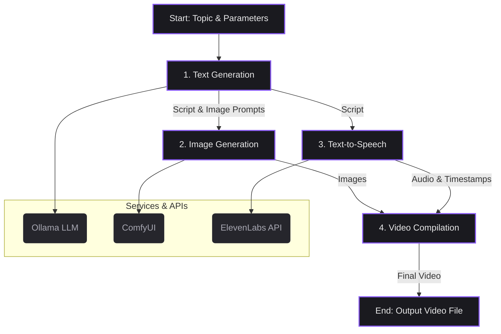
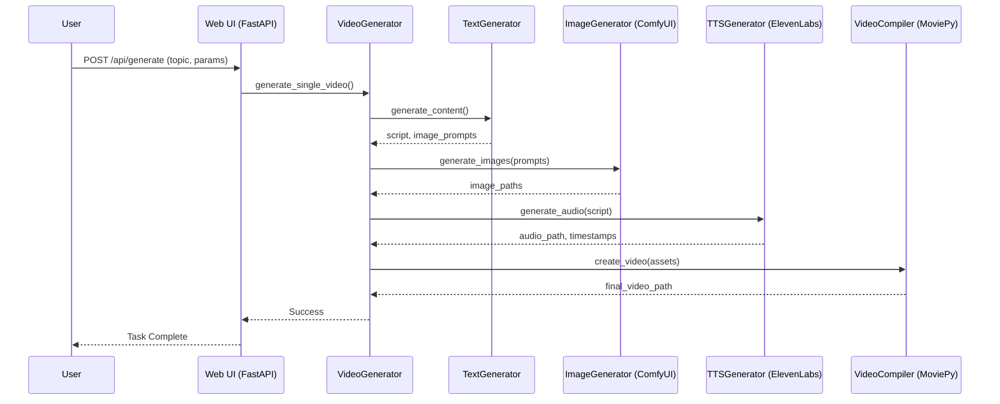

# 🎬 AI Video Generator

<p align="center">
  
  
  
  <a href="https://github.com/MaLoskins">
    
  </a>
</p>

This repository contains an advanced, modular application for automatically generating short-form videos from a text prompt. The system orchestrates multiple AI models for text generation, image synthesis, and text-to-speech, then compiles the assets into a polished final video, complete with dynamic subtitles, transitions, and effects.

The project features a powerful command-line interface for single and batch operations, alongside a sleek FastAPI-powered web interface for interactive video creation and management.

## Table of Contents

- [Key Features](#key-features)
- [System Architecture](#system-architecture)
- [Setup and Installation](#setup-and-installation)
- [Usage Guide](#usage-guide)
- [Module Overview](#module-overview)
- [Contributing](#contributing)
- [License](#license)
- [Author](#author)

## Key Features

-   **Modular Pipeline**: A decoupled architecture for text generation, image synthesis, audio creation, and video compilation, allowing for independent upgrades and maintenance.
-   **Multi-Model Integration**:
    -   **Text Generation**: Leverages local LLMs (e.g., `llama2-uncensored`) via the **Ollama** framework.
    -   **Image Generation**: Integrates with **ComfyUI** to support multiple diffusion models like **Flux** and **Stable Diffusion**.
    -   **Text-to-Speech**: Utilizes the **ElevenLabs API** for high-quality, human-like voiceovers with precise word-level timestamping.
-   **Dynamic Content Creation**:
    -   Generates unique video scripts and image prompts from a base topic using a variety of content styles (e.g., `conspiracy_theory`, `fun_facts`, `scary_story`).
    -   Prompt templates are easily customizable in `prompts.py`.
-   **Advanced Video Composition**:
    -   **Dynamic Subtitles**: Supports multiple animation styles (`phrase`, `word-by-word`, `typewriter`) and customizable formatting options.
    -   **Motion Effects**: Automatically applies the Ken Burns effect (panning and zooming) to static images to create a dynamic viewing experience.
    -   **Customizable Transitions**: Offers a variety of transition styles (`fade`, `slide`, `zoom`) between scenes.
-   **Dual Interfaces**:
    -   **Web Interface**: A modern, responsive frontend built with FastAPI and vanilla JavaScript for generating, managing, and previewing videos.
    -   **Command-Line Interface**: A powerful CLI for single video generation, complex batch processing, and experimental ablation testing.
-   **Robust and Efficient**: The system is designed for performance, featuring asynchronous operations, parallel processing for batch jobs, error handling with retries, and system resource monitoring.
-   **Developer Utilities**: Includes pre-built tools for monitoring batch progress (`monitor.py`) and diagnosing dependency conflicts (`fix_websocket.py`).

## System Architecture

The video generation process is an automated pipeline that coordinates several local and cloud-based AI services.

### High-Level Component Flow



### Request Sequence Diagram (Web UI)

This diagram illustrates the flow of a request from the user to the final video creation.



## Setup and Installation

Follow these steps to configure and run the project locally.

#### 1. System Prerequisites

-   **Python**: Version 3.10 or higher.
-   **FFmpeg**: Required for video processing. [Install FFmpeg](https://ffmpeg.org/download.html) and ensure it's in your system's PATH.
-   **Ollama**: For local text generation. [Download and install Ollama](https://ollama.com/), then pull a model:
    ```bash
    ollama pull llama2-uncensored
    ```-   **ComfyUI**: For image generation. [Install ComfyUI](https://github.com/comfyanonymous/ComfyUI) and ensure it is running on `http://127.0.0.1:8188`.
    -   You must also have the required ComfyUI custom nodes and models needed to run the `flux-kontext.json` and `SD.json` workflows.

#### 2. Project Installation

1.  **Clone the repository:**
    ```bash
    git clone https://github.com/MaLoskins/Vid-Gen-Test-Changes.git
    cd Vid-Gen-Test-Changes
    ```

2.  **Create and activate a virtual environment:**
    ```bash
    python -m venv venv
    source venv/bin/activate  # On Windows: venv\Scripts\activate
    ```

3.  **Install dependencies:**
    A `requirements.txt` file is not included. Based on the imports, install the following packages:
    ```bash
    pip install fastapi uvicorn requests moviepy numpy Pillow
    pip install langchain-ollama python-dotenv gputil psutil
    pip install websocket-client==1.4.2
    ```
    > **Note:** The `websocket-client` version is critical for ComfyUI API compatibility. If you encounter issues, run the included diagnostic script: `python fix_websocket.py`

#### 3. Configuration

1.  **Create an Environment File:**
    Copy the `.env` file from the `frontend` directory to the project root, or create a new file named `.env` in the root directory.

2.  **Set API Key:**
    Open the `.env` file and add your ElevenLabs API key:
    ```env
    ELEVENLABS_API_KEY=your_elevenlabs_api_key_here
    ```

3.  **Review `config.py`:**
    This file contains default settings for models, server URLs, and video parameters. You can override these by setting environment variables with the same name.

## Usage Guide

The application can be operated via the Web UI or the CLI.

### Web Interface (Recommended)

The web UI provides a user-friendly way to generate and manage videos.

1.  **Start the Backend Server:**
    Navigate to the `frontend` directory and run the Uvicorn server:
    ```bash
    cd frontend
    uvicorn server:app --host 0.0.0.0 --port 8000 --reload
    ```

2.  **Access the UI:**
    Open your browser and navigate to **http://localhost:8000**. The interface allows for generating new videos, monitoring progress, and managing your gallery of created content.

### Command-Line Interface

The CLI is ideal for scripting, batch generation, and advanced testing.

#### Single Video Generation

Generate one video with a specific topic.

```bash
# Basic usage with default settings
python main.py "The secret life of garden gnomes"

# Generate with custom parameters
python main.py "Why printers smell fear" --prompt_type conspiracy_theory --model SD --voice expressive
```

#### Batch Processing

Generate multiple videos in a single run.

```bash
# Generate 10 videos with random settings
python main.py --batch --num-runs 10

# Generate videos from a file containing one topic per line
python main.py --batch --prompts-file list_of_prompts.txt --model Flux --parallel 2
```

Refer to `batch_example.py` for more advanced batch scripting.

#### Monitoring and Reporting

Use the `monitor.py` script to track batch progress and analyze results.

```bash
# Watch the latest batch run in real-time
python monitor.py watch

# Generate a detailed report for all completed batches
python monitor.py report

# Save the report to a file
python monitor.py report --save-report batch_report.txt
```

## Module Overview

The project is structured into several key Python modules:

| File                 | Description                                                                                             |
| -------------------- | ------------------------------------------------------------------------------------------------------- |
| `main.py`            | The main entry point for the CLI. Orchestrates the entire video generation pipeline.                    |
| `frontend/server.py` | The FastAPI server that powers the web interface, providing API endpoints for generation and management.|
| `config.py`          | Loads and manages global configuration from environment variables and `.env` files.                     |
| `video_config.py`    | Contains dataclasses for defining detailed video parameters (subtitles, transitions, effects).          |
| `prompts.py`         | Stores all prompt templates for different content styles, used by the text generator.                   |
| `text_generation.py` | Interfaces with Ollama to generate the main script and image descriptions based on a topic.             |
| `image_generation.py`| A standalone script that interfaces with ComfyUI to generate images from text prompts.                  |
| `comfy_api.py`       | A low-level client for communicating with the ComfyUI WebSocket API.                                    |
| `tts.py`             | Interfaces with the ElevenLabs API to convert text to speech and retrieve word-level timestamps.        |
| `create_video.py`    | The core video compilation module. Uses MoviePy to combine images, audio, and subtitles into a video.   |
| `monitor.py`         | A utility for analyzing batch run outputs, generating reports, and tracking live progress.              |
| `batch_example.py`   | Contains example functions for scripting more complex and customized batch generation jobs.             |
| `fix_websocket.py`   | A diagnostic tool to detect and resolve common `websocket-client` dependency conflicts.                 |

## Contributing

Contributions are highly encouraged! If you have suggestions for improvements or want to add new features, please follow these steps:

1.  Fork the Project.
2.  Create your Feature Branch (`git checkout -b feature/NewFeature`).
3.  Commit your Changes (`git commit -m 'Add some NewFeature'`).
4.  Push to the Branch (`git push origin feature/NewFeature`).
5.  Open a Pull Request.

## License

This project is distributed under the MIT License. See the `LICENSE` file for more information.

## Author

-   **Matthew Loskins** - [GitHub Profile](https://github.com/MaLoskins)